# 2025年你必须了解的13款顶级LinkedIn自动化获客工具

做B2B销售或者运营LinkedIn账号的人都明白,手动发连接请求、写私信、跟进潜在客户有多耗时。每天在LinkedIn上花几个小时,结果可能只联系到十几二十个人,效率实在太低了。市面上现在有一批LinkedIn自动化工具,能帮你自动发送连接邀请、安排消息序列、追踪回复情况,甚至管理多个账号同时运作。这些工具用的是云端或浏览器扩展技术,在不违反LinkedIn使用规则的前提下,把你的获客效率提升几倍甚至十几倍。这份榜单整理了13个值得关注的平台,覆盖从单账号自动化到多账号团队管理的各种场景,帮你快速找到最适合自己业务模式的那个。

## **[HeyReach](https://heyreach.io)**

多账号无限发送者管理,固定价格不限量的规模化获客平台。

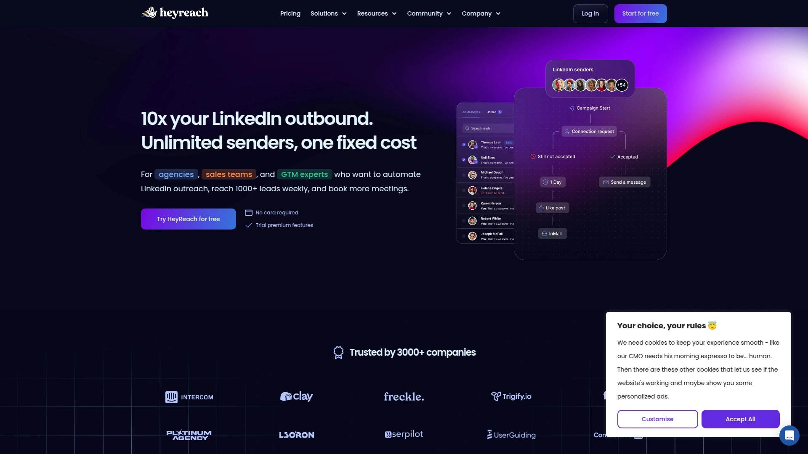

大多数LinkedIn自动化工具的问题是按账号收费,你想扩大规模就得不断加钱。HeyReach的定价逻辑完全不同——它允许你在一个订阅下连接无限数量的LinkedIn账号,所有账号可以协同运作在同一个外展序列上。这个设计特别适合代理公司和大型销售团队,因为现在LinkedIn每天限制20-40个连接邀请,单账号根本无法满足规模化需求。

多发送者功能自带防重复机制,确保同一个潜在客户不会被你的不同账号重复骚扰。统一收件箱让你在一个地方管理所有账号的消息,不用来回切换登录。你可以代表团队成员回复消息,甚至在桌面端发送语音留言。和Clay、RB2B、Trigify、Persana这些工具有原生集成,还支持HubSpot、Make、Zapier的一键连接。

实时监控功能可以追踪潜在客户行为、查看每个发送者的表现、运行A/B测试、分析不同序列步骤的效果。Agency计划每月799美元可以管理最多50个LinkedIn账号,Unlimited计划1999美元/月支持无限账号。API功能是市场上最全面的,有20多个webhook事件和白标选项。特别适合需要规模化LinkedIn获客的营销代理、SDR团队、有多个销售人员的企业。

## **[Expandi](https://expandi.io)**

账号安全性高、支持个性化外展的云端自动化工具。

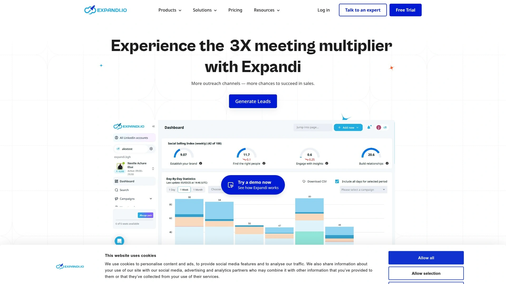

Expandi从一开始就把账号安全放在首位,它是纯云端运行的工具,不需要你一直开着浏览器。这个设计比浏览器插件类工具更安全,因为它模拟真人行为的方式更自然。账号预热功能会在正式开始大规模外展前,逐步增加你的活动量,让LinkedIn算法认为你是正常使用。

智能收件箱会自动检测回复的情绪和意图,帮你快速筛选出真正有兴趣的潜在客户。可以设置"If Connected"条件逻辑,对已经是好友的人发送不同的消息序列,避免发重复内容显得很蠢。支持LinkedIn和邮件的组合序列,让你的触达不只局限在LinkedIn平台。动态图片个性化功能可以在图片中插入潜在客户的名字或公司logo,提升打开率。

月费79美元起,提供14天免费试用。界面设计很直观,新手也能快速上手。有详细的活动报告,可以看到每个步骤的转化率。比较适合重视账号安全、需要精细化个性化外展的独立销售、小型团队或者咨询顾问。如果你只需要基础自动化功能,可能会觉得价格有点贵。

## **[Dripify](https://dripify.com)**

可视化流程构建器,强大的分析功能和团队管理。

Dripify的核心优势是它的可视化流程构建器。你可以拖拽不同的动作模块,创建复杂的外展序列——比如"如果对方48小时内没回复就发送提醒,如果回复了就打上标签通知销售跟进"。这种条件触发逻辑让你的外展更智能,不会像机器人那样死板。

A/B测试功能内置在平台里,可以同时运行多个消息版本,系统会自动追踪哪个版本效果更好。超过15个个性化变量可以用,不只是名字和公司,还能插入行业、职位、共同好友这些细节。团队管理功能比很多竞品强,你可以监控团队成员的表现、升级或降级他们的计划、甚至直接登录他们的账号查看情况。

原生集成的CRM最多,包括Salesforce、HubSpot、Pipedrive、Zoho、Monday.com、Copper等等。这些集成是双向同步的,LinkedIn对话历史会自动推送到CRM,CRM里的潜在客户信息也能拉过来做个性化。月费39美元起每用户,有7天免费试用。详细的统计页面可以查看整体账号数据、活动表现、团队表现。适合需要复杂外展流程、重视数据分析的营销团队和代理公司。

## **[Waalaxy](https://www.waalaxy.com)**

结合LinkedIn和邮件外展的多渠道触达工具。

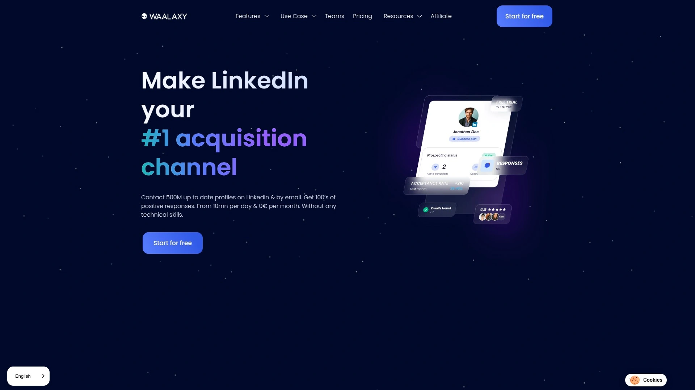

Waalaxy最大的特点是它把LinkedIn自动化和邮件外展整合在一起。你可以设计一个序列:先在LinkedIn发连接请求,连接后发第一条消息,如果对方不回复就自动发邮件跟进。这种多渠道策略的回复率比单纯用LinkedIn高很多。

预设的序列模板覆盖各种场景,比如销售外展、招聘、活动邀请等等。虽然不能像Dripify那样完全自定义流程,但这些模板对新手很友好,选一个填上内容就能用。和HubSpot、Pipedrive、DropContact这些CRM有原生集成,可以同步联系人信息。

月费21美元起每用户,是这个榜单上价格最实惠的工具之一。需要注意的是Waalaxy是Chrome扩展,你得保持浏览器开着活动才能运行,关掉浏览器自动化就停了。有用户反馈工具有一些bug,比如有时会重复发送消息或者混淆不同活动的联系人。适合预算有限、需要多渠道触达、对流程自定义要求不高的小型团队或个人。

## **[Phantombuster](https://phantombuster.com)**

数据抓取+自动化外展的全能型工具。

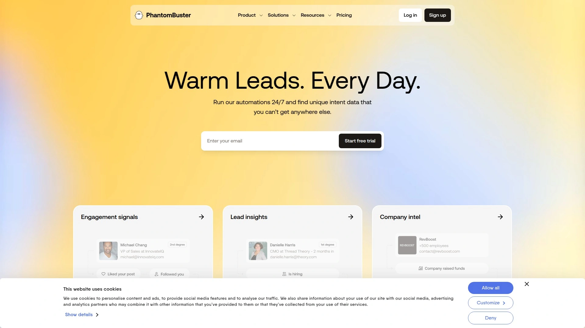

Phantombuster不只是LinkedIn自动化工具,它更像是一个全平台的数据抓取和自动化引擎。它的"Phantoms"(单个自动化)和"Flows"(自动化序列)可以从LinkedIn搜索结果、活动参与者、帖子评论、甚至Google Maps搜索结果里提取数据,直接生成带有专业邮箱和联系方式的潜在客户清单。

数据富化功能可以自动补全你现有客户清单里的缺失信息,包括电话号码和邮箱地址。LinkedIn Outreach Flow是预构建的自动化流程,可以发送连接邀请加上介绍消息,然后最多发3条跟进消息。为了遵守LinkedIn限制,工具会控制每天最多发送20个连接请求,你可以逐步增加。

月费56美元起按年付费,提供14天免费试用。云端运行不需要开着浏览器。和其他只做LinkedIn的工具相比,Phantombuster的独特价值在于它能跨平台提取数据——Facebook、Instagram、X、Google Maps都能用。特别适合需要大量数据抓取、做潜在客户研究、或者从多个渠道获取线索的团队。如果只是偶尔抓点数据,可能不需要订阅制服务。

## **[Meet Alfred](https://meetalfred.com)**

多渠道活动编排,支持LinkedIn、邮件和X平台。

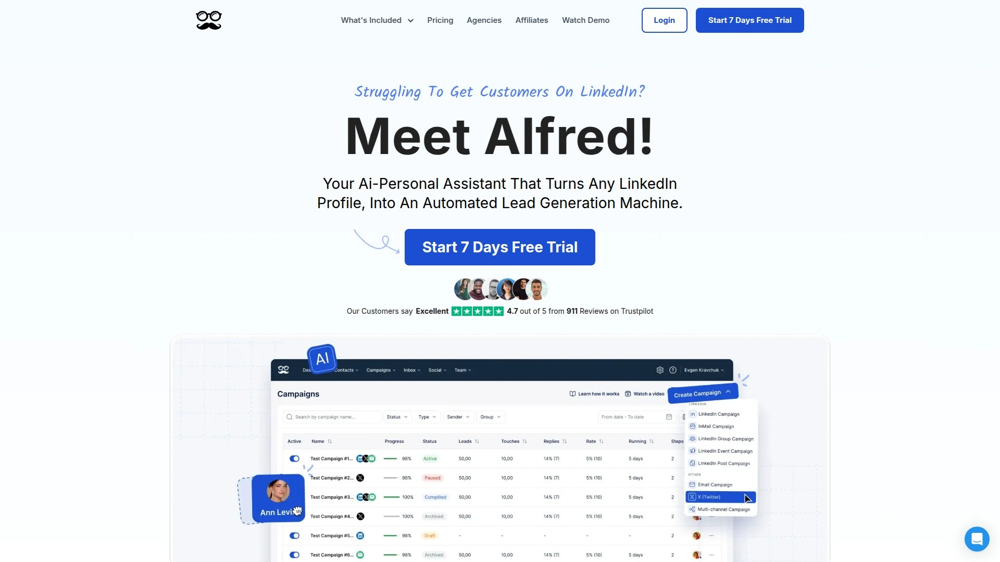

Meet Alfred的定位是多渠道外展平台,除了LinkedIn自动化,还支持邮件和X(原Twitter)。你可以创建一个活动,先在LinkedIn发连接请求,然后在X上关注对方,接着发邮件,最后在LinkedIn发消息。这种多触点策略能显著提升回复率,因为潜在客户会在不同平台上多次看到你。

团队协作功能做得不错。多个销售人员可以在同一个控制面板上工作,管理员能看到每个人的活动表现和未读消息。自动化序列支持时间延迟和条件触发,比如"如果对方在LinkedIn上接受了连接但没回复消息,等3天后发邮件"。

月费29美元起每用户,中等价位。有Chrome扩展方便快速添加潜在客户。CRM集成功能可以和HubSpot、Salesforce、Pipedrive同步数据。适合需要跨渠道触达、有小型销售团队需要协作的B2B公司。如果只需要LinkedIn自动化可能用不上它的全部功能。

## **[Octopus CRM](https://octopuscrm.io)**

超低价格的浏览器扩展式自动化工具。

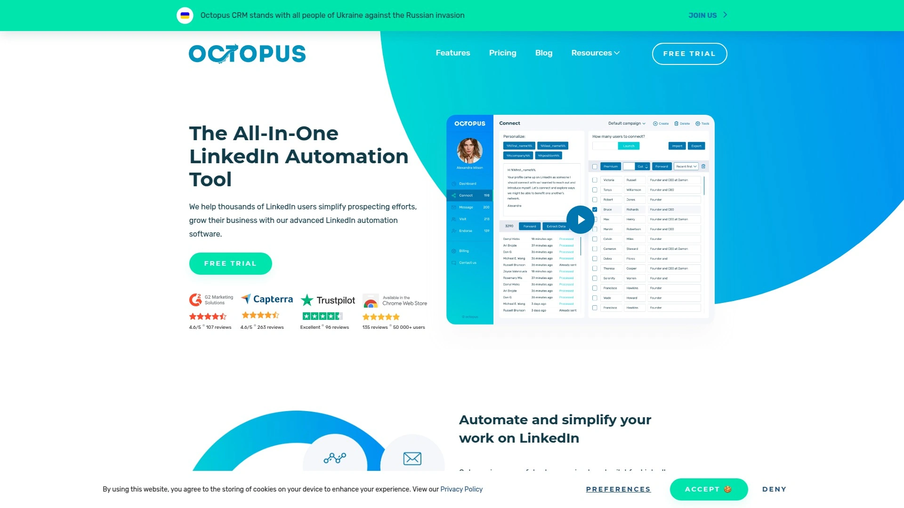

Octopus CRM最大的吸引力就是价格——起步价只要每月9.99美元。作为一个Chrome扩展,它直接和LinkedIn界面集成,提供基础但完整的自动化功能。可以自动发送连接请求、消息序列、访问个人资料、点赞帖子、甚至给技能背书。

滴灌活动功能可以创建一系列LinkedIn动作组成的营销漏斗。高级分析功能追踪关键指标,帮你评估活动表现。潜在客户回复功能可以自定义自动回复消息,实现个性化互动。团队管理功能允许管理多个成员并实时监控他们的表现。

四个定价层次:Starter 9.99美元/月基础自动化,Pro 14.99美元/月高级功能,Advanced 21.99美元/月全面能力,Unlimited 39.99美元/月无限制访问所有功能。年付有折扣。安全功能内置可以防止账号被限制。数据提取功能可以导出CSV文件方便系统集成。

特别适合预算紧张的个人、小企业、初创公司、刚开始做LinkedIn获客的团队。因为是浏览器扩展需要保持Chrome开启,而且功能深度不如云端工具。但对于基础需求来说性价比极高。

## **[Lemlist](https://lemlist.com)**

个性化多渠道外展,动态图片和视频定制。

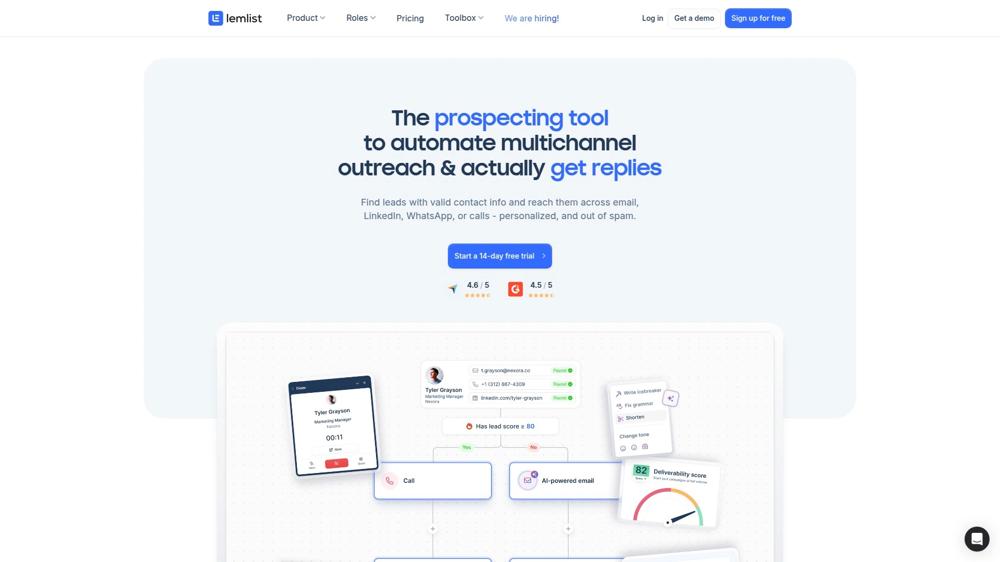

Lemlist把LinkedIn外展和邮件活动无缝整合,可以从一个平台管理跨渠道的工作流程。它的个性化能力特别强——不只是插入变量那么简单,而是可以基于潜在客户数据、公司信息、之前的互动历史生成真正有针对性的内容。这种情境化的相关性能大幅提升互动率。

动态图片定制功能是它的招牌。你可以上传一个带有占位符的图片模板,系统会自动为每个潜在客户生成包含他们名字、公司logo、甚至网站截图的个性化图片。视频个性化也能做,录一段通用的开场,系统会自动在视频里插入每个人的名字和公司。

A/B测试功能可以跨渠道运行,同时测试LinkedIn消息和邮件的不同版本。和各种CRM集成实现数据同步。团队协作功能支持多人共同管理活动。邮件送达率优化工具能提升邮件进收件箱的概率。

定价从Email Outreach 59美元/月起,Sales Engagement 99美元/月,Enterprise 159美元/月。有年付折扣。学习曲线中等,需要一点时间熟悉各种功能。特别适合注重个性化、需要跨渠道外展、愿意在创意上投入时间的销售团队。

## **[Linked Helper](https://www.linkedhelper.com)**

性价比极高的桌面端LinkedIn自动化软件。

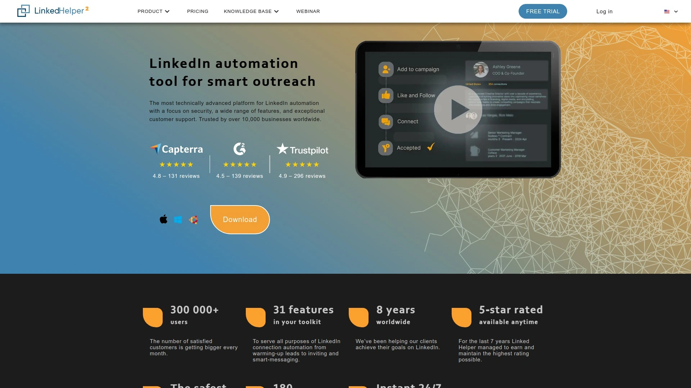

Linked Helper是个桌面应用程序,不是浏览器扩展也不是云端服务。月费只要8.25美元,是榜单上最便宜的工具。它提供的功能却很全面——自动连接请求、消息序列、群组消息发送、技能背书、帖子点赞等等。

可以创建多步骤的跟进序列,对不同类型的潜在客户发送不同的消息路径。标签和笔记功能帮你分类管理联系人。数据导出功能可以把联系人信息保存为CSV文件。虽然界面设计比较传统,但该有的功能都有。

因为是桌面应用,你得保持软件运行才能执行自动化任务。没有云端工具那样可以后台运行的便利性。客服响应速度和平台稳定性也不如那些大品牌工具。但考虑到价格,这些缺点是可以接受的。

特别适合预算极度有限的个人、自由职业者、小型企业,或者只是想试试LinkedIn自动化效果的新手。不适合需要团队协作、高级分析、或者大规模多账号管理的场景。

## **[La Growth Machine](https://lagrowthmachine.com)**

多渠道工作流设计,潜在客户数据自动富化。

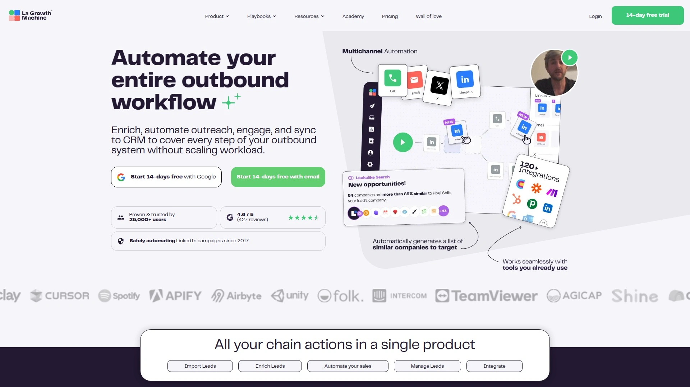

La Growth Machine是一个多渠道外展自动化工具,支持LinkedIn消息、冷邮件和Twitter私信。它的工作流编排能力很强,可以设计利用多个渠道的复杂活动,确保你的外展被注意到并产生影响。

潜在客户富化功能会自动查找和补充缺失的信息,完善联系人详情。导入、分段、管理潜在客户的功能很完善。表现分析功能可以追踪每个外展活动的有效性。和各种CRM工具及平台的集成能力很强。

定价信息需要访问官网获取。界面设计现代简洁,学习曲线中等。适合需要多渠道触达、重视数据完整性、有一定技术能力的营销团队。如果只需要LinkedIn单一渠道自动化,可能用不上它的全部功能。

## **[WeConnect](https://www.weconnect.chat)**

开放档案识别,高效定位可直接触达的目标。

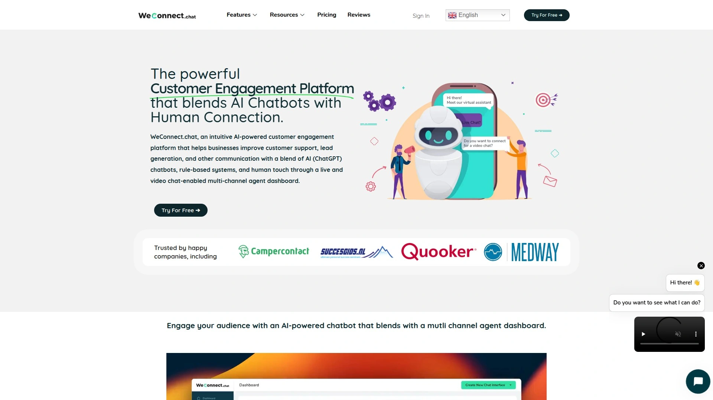

WeConnect的独特功能是开放档案识别系统。它会自动标记那些设置了"接受站外消息"的LinkedIn用户,这些人即使不是你的好友也能收到你的消息。这创造了无需发送连接请求就能直接触达的机会,大幅提升效率。

连接请求功能支持基于个人资料数据、共同好友、公司信息的高级个性化。这种情境化的相关性能显著提升接受率,通常能超过50%。活动序列设计得很自然,不会让人觉得是机器人。全面的安全功能保护账号不被封。

详细的分析仪表板可以追踪关键指标。实施起来很简单,培训时间短。团队协作功能支持多人共同管理活动。定价很合理,Standard计划49美元/月,Pro计划79美元/月,Agency有定制价格。年付有折扣。

适合注重效率、希望减少连接等待时间、需要快速扩大触达范围的销售团队和代理公司。界面简洁易用,新手也能快速上手。

## **[Dux-Soup](https://www.dux-soup.com)**

简单实用的Chrome扩展,和CRM深度同步。

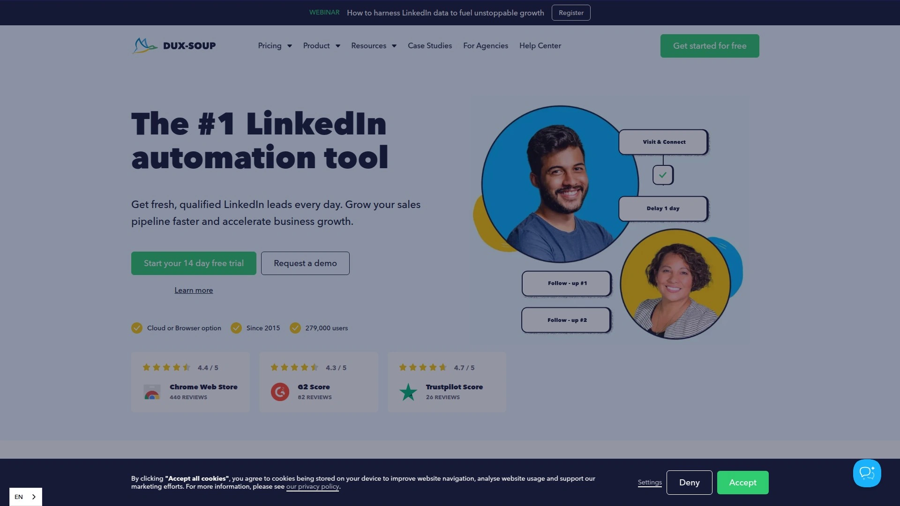

Dux-Soup是一个轻量级的Chrome扩展,专注于简化LinkedIn外展流程。它的核心功能包括自动访问个人资料、发送连接请求、消息跟进、给潜在客户打标签。虽然功能不如那些复杂平台全面,但该有的基础能力都具备。

和CRM的集成做得很好,支持HubSpot、Salesforce、Pipedrive等主流平台。可以把LinkedIn上找到的潜在客户信息自动同步到CRM,省去手动输入的麻烦。标签系统可以帮你分类管理不同类型的联系人,比如"已回复""需跟进""已转化"等等。

月费11.25美元起,价格很亲民。界面设计直观,新手10分钟就能搞明白怎么用。作为浏览器扩展需要保持Chrome运行,关掉浏览器自动化就停了。没有高级的A/B测试、多渠道编排、团队管理这些功能。

特别适合独立销售、小型企业、预算有限但需要CRM集成的用户。如果已经在用某个CRM并且主要在LinkedIn上找客户,Dux-Soup会是个省心的选择。不适合需要复杂自动化流程或者大规模团队协作的场景。

## **[Sprout Social](https://sproutsocial.com)**

全渠道社交媒体管理平台,LinkedIn自动化只是其中一环。

Sprout Social是一个全面的社交媒体管理工具,LinkedIn自动化是它众多功能中的一部分。它的LinkedIn管理工具可以帮你自动化发布、回复管理、整体分析,比如LinkedIn标签分析。这让它成为最佳的一站式LinkedIn自动化工具。

发布功能可以起草和安排LinkedIn更新,设置好时间自动发出。你可以把这些更新加入队列,不只为一个而是为多个LinkedIn页面自动化发布。甚至可以根据行业、公司规模、职位自动定向特定人群。

回复管理功能很贴心——可以在一个地方监控和回复所有LinkedIn评论。LinkedIn Contact View会自动调取某个用户之前和你页面的互动历史,让你能根据上下文个性化回复。自动收集LinkedIn页面和帖子的表现数据,帮你分析发布策略并理解如何改进。

定价需要联系获取报价,定位是企业级工具。如果只需要LinkedIn外展自动化,Sprout可能功能过剩且价格偏高。但如果你需要管理多个社交媒体平台(Facebook、Instagram、X、LinkedIn等),Sprout能提供统一的管理体验。适合大型企业、营销代理、需要全渠道社交媒体管理的团队。

## **[LinkedIn Sales Navigator](https://business.linkedin.com/sales-solutions/sales-navigator)**

LinkedIn官方的高级销售工具,数据最全面最安全。

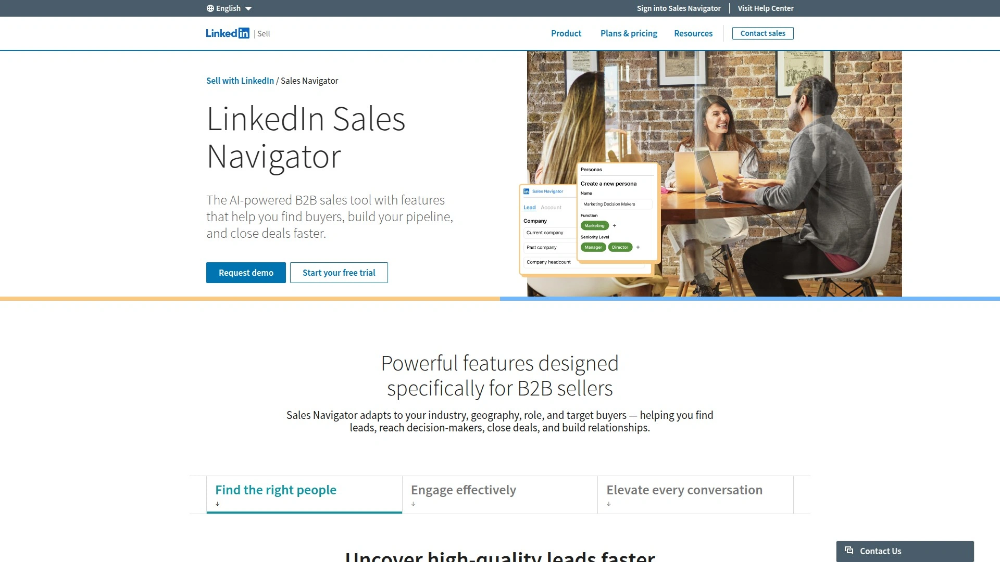

Sales Navigator是LinkedIn官方推出的销售工具,严格来说不算自动化软件,但它是所有LinkedIn外展策略的基础。它提供高级搜索选项,可以基于职位、公司规模、地理位置、行业等具体条件找到理想客户。这些筛选器比免费LinkedIn账号能用的细致很多。

潜在客户和账户的实时更新功能会告诉你目标客户的动态——比如换了工作、公司融资、发了新帖子等等。这些信号是开启对话的最佳时机。可以保存潜在客户和账户列表,持续追踪他们的变化。InMail功能允许你给不是好友的人发消息,每月有固定额度。

Social Selling Index工具会给你的社交销售能力打分,从品牌建立、找对的人、用洞察互动、建立关系四个维度评估。这个指标帮你了解自己的LinkedIn策略哪里做得好哪里需要改进。月费79.99美元起每用户,企业版有更多功能。

因为是官方工具,账号安全性最高,不会有被封号的风险。它提供的潜在客户数据是所有第三方工具的基础数据来源。适合重视数据质量和账号安全、需要深度潜在客户研究、愿意手动或配合其他自动化工具使用的专业销售人员。

## FAQ常见问题

**用这些自动化工具会不会导致LinkedIn账号被封?**

只要合理使用基本不会。LinkedIn确实会监测和限制过度自动化行为,但榜单上这些工具都内置了安全机制——比如限制每天最多发送20-40个连接请求,模拟真人操作时间间隔,避免重复动作。建议刚开始不要从第一天就满负荷运行,而是逐步增加活动量让账号"预热",这样最安全。云端工具比浏览器扩展相对更安全,因为它们模拟真人行为的算法更成熟。

**单账号工具和多账号管理工具怎么选?**

看你的规模需求。如果是个人或者小团队(1-3人),单账号工具像Expandi、Dripify、Waalaxy就够用了,价格实惠功能也完善。如果是营销代理、大型销售团队(5人以上),或者需要突破LinkedIn每日邀请限制快速扩大触达范围,就选HeyReach这种多账号管理平台。多账号工具可以让多个LinkedIn账号协同工作在同一个外展序列上,大幅提升每日能联系的潜在客户数量。

**这些工具的回复率和转化效果如何?**

取决于你的消息质量和目标受众精准度,不是工具本身。同一个工具,有人回复率能达到30-50%,有人只有5-10%。关键是做好这几点:用Sales Navigator或者工具的高级筛选精准定位目标人群,写个性化的消息而不是群发模板,利用A/B测试找到效果最好的文案,及时跟进有回复的潜在客户。多渠道策略(LinkedIn+邮件+X)的效果通常比单一渠道好,因为潜在客户会在不同地方多次看到你。

## 总结

如果你是代理公司或者大型销售团队,需要管理多个LinkedIn账号协同获客而不想为每个账号单独付费,[HeyReach](https://heyreach.io)的无限发送者模式会是最具性价比的选择。它的多账号防重复机制、统一收件箱、强大的原生集成能力特别适合规模化外展场景。当然每个工具都有自己的优势——预算紧张选Octopus CRM或Linked Helper,注重个性化选Expandi或Lemlist,需要多渠道触达选Meet Alfred或La Growth Machine。工具只是放大器,最终决定效果的还是你对目标客户的理解和消息内容的质量。
